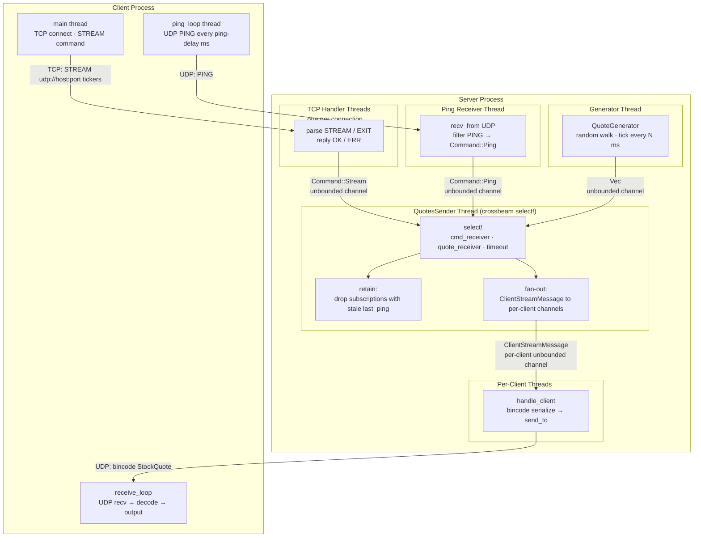

# Stock Quote Streaming System

Сервер и клиент для бинарного UDP стрима котировок

## Че делает

**Server** (`quote_server`) - генерирует данные Quote и рассылает по клиентам:
- Клиент подключается по TCP
- По `STREAM` команде и переданным UDP сокет адресу и списку тикеров регистрирует клиента 
- Делает Fan Out по всем клиентам
- Если клиент не заслалает `PING` с заданой регулярностью, отключает клиента

**Client** (`quote_client`) - подключается к серверу и получает данные стонксов:
- Клиент подключается по TCP и шлет `STREAM` команду
- Получает `bincode`-кодированный стонк квот `StockQuote` по UDP
- Переодически делает `PING` чтобы сервер не перестал слать сообщения
- Выводит данные по тикерам

## tl;dr

```
Client → Server (TCP):   STREAM udp://127.0.0.1:6667 AAPL,MSFT,TSLA
Server → Client (TCP):   OK
Server → Client (UDP):   <bincode StockQuote>
Client → Server (UDP):   PING
Client → Server (TCP):   EXIT
```

## схема потоков



## Как включить

```bash
# Server - дефолтные настройки: TCP :8971, UDP :8988, tickers from server/cfg/tickers
cargo run -p server

# Server - кастомные настройки
cargo run -p server -- \
  --tcp-port 8971 \
  --udp-port 8988 \
  --ticker-list server/cfg/tickers \
  --delay-ms 2000 \
  --ping-cooldown-ms 5000 \
  --tick-duration-ms 1000 \
  --price-deviation 5 \
  --capacity 100

# Client - дефолтные настройки: server 127.0.0.1:8971, UDP callback :6667
cargo run -p client

# Client - кастомные настройки
cargo run -p client -- \
  --server-addr 127.0.0.1:8971 \
  --udp-uri 127.0.0.1:8988 \
  --udp-port 6667 \
  --tickers-file client/cfg/tickers \
  --ping-delay 1000 \
  --output-file quotes.log   # можно не задавать, чтобы выводило в stdout
```
